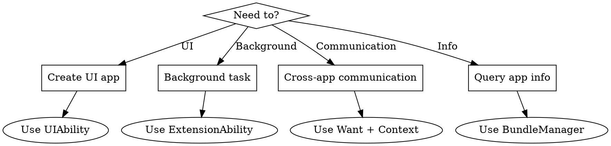

# OpenHarmony Ability Kit Quick Reference

## Overview

Ability Kit is the core framework for managing application components in OpenHarmony Stage Model. It provides:

- **UIAbility**: UI-based application components with lifecycle management
- **AbilityStage**: Module-level component manager for initialization
- **Want**: Data carrier for inter-component communication
- **Context**: Application/component context for resource access and operations
- **ExtensionAbility**: Extended capabilities (Form, Service, etc.)
- **BundleManager**: Package and application information queries

**Official docs:** `docs-OpenHarmony-v6.0-Release/zh-cn/application-dev/reference/apis-ability-kit/`

## Decision Flow



## Quick Reference Table

| Module | API Version | Purpose | Import |
|--------|-------------|---------|--------|
| UIAbility | 9+ | UI application component | `import { UIAbility } from '@kit.AbilityKit'` |
| AbilityStage | 9+ | Module-level manager | `import { AbilityStage } from '@kit.AbilityKit'` |
| Want | 9+ | Component communication | `import { Want } from '@kit.AbilityKit'` |
| common (Context) | 9+ | Context APIs | `import { common } from '@kit.AbilityKit'` |
| bundleManager | 9+ | Package queries | `import { bundleManager } from '@kit.AbilityKit'` |
| wantAgent | 9+ | Want encapsulation | `import { wantAgent } from '@kit.AbilityKit'` |
| appManager | 9+ | App lifecycle management | `import { appManager } from '@kit.AbilityKit'` |
| AbilityConstant | 9+ | Ability constants | `import { AbilityConstant } from '@kit.AbilityKit'` |
| Configuration | 9+ | System configuration | `import { Configuration } from '@kit.AbilityKit'` |

## UIAbility Lifecycle

### Lifecycle States

```
Create -> WindowStageCreate -> Foreground <-> Background -> WindowStageDestroy -> Destroy
```

### Key Callbacks

| Callback | When Called | Use Case |
|----------|-------------|----------|
| `onCreate(want, launchParam)` | Ability created | Initialize non-UI resources |
| `onWindowStageCreate(windowStage)` | Window ready | Load UI content, set window properties |
| `onForeground()` | Entering foreground | Resume operations, refresh data |
| `onBackground()` | Entering background | Save state, release resources |
| `onWindowStageDestroy()` | Window destroying | Clean up window resources |
| `onDestroy()` | Ability destroying | Final cleanup |
| `onNewWant(want, launchParam)` | Re-activated (singleton) | Handle new intent |

### Basic UIAbility Template

```typescript
import { UIAbility, AbilityConstant, Want } from '@kit.AbilityKit';
import { window } from '@kit.ArkUI';
import { hilog } from '@kit.PerformanceAnalysisKit';

export default class EntryAbility extends UIAbility {
  onCreate(want: Want, launchParam: AbilityConstant.LaunchParam): void {
    hilog.info(0x0000, 'testTag', 'Ability onCreate');
    // Initialize non-UI resources
  }

  onWindowStageCreate(windowStage: window.WindowStage): void {
    hilog.info(0x0000, 'testTag', 'Ability onWindowStageCreate');
    
    // Load main page
    windowStage.loadContent('pages/Index', (err, data) => {
      if (err.code) {
        hilog.error(0x0000, 'testTag', 'Failed to load content: %{public}s', JSON.stringify(err));
        return;
      }
      hilog.info(0x0000, 'testTag', 'Succeeded in loading content');
    });
  }

  onForeground(): void {
    hilog.info(0x0000, 'testTag', 'Ability onForeground');
  }

  onBackground(): void {
    hilog.info(0x0000, 'testTag', 'Ability onBackground');
  }

  onDestroy(): void {
    hilog.info(0x0000, 'testTag', 'Ability onDestroy');
  }
}
```

### Launch Types

| Type | Value | Description | Use Case |
|------|-------|-------------|----------|
| `SINGLETON` | 0 | Single instance | Main entry, settings |
| `MULTITON` | 1 | Multiple instances | Document editor |
| `SPECIFIED` | 2 | Developer-controlled | Custom instance management |

Configure in `module.json5`:
```json
{
  "abilities": [{
    "name": "EntryAbility",
    "launchType": "singleton"
  }]
}
```

## AbilityStage

Module-level component manager, created before any Ability in the module.

### Key Callbacks

| Callback | When Called | Use Case |
|----------|-------------|----------|
| `onCreate()` | Module first loaded | Resource preloading, thread creation |
| `onDestroy()` | Last ability exits (API 12+) | Module cleanup |
| `onAcceptWant(want)` | Specified launch mode | Return unique ability key |
| `onConfigurationUpdate(config)` | System config changes | Handle language/theme changes |
| `onMemoryLevel(level)` | Memory pressure | Release non-essential resources |

### Basic AbilityStage Template

```typescript
import { AbilityStage, Want, Configuration, AbilityConstant } from '@kit.AbilityKit';

export default class MyAbilityStage extends AbilityStage {
  onCreate(): void {
    console.log('MyAbilityStage onCreate');
    // Module initialization
  }

  onAcceptWant(want: Want): string {
    // For specified launch mode, return unique key
    if (want.abilityName === 'DocumentAbility') {
      return want.parameters?.docId as string || 'default';
    }
    return '';
  }

  onConfigurationUpdate(config: Configuration): void {
    console.log(`Config updated: ${JSON.stringify(config)}`);
  }

  onMemoryLevel(level: AbilityConstant.MemoryLevel): void {
    console.log(`Memory level: ${level}`);
    // Release caches when memory is low
  }
}
```

## Want Object

Data carrier for component communication.

### Want Structure

| Field | Type | Description |
|-------|------|-------------|
| `bundleName` | string | Target bundle name |
| `abilityName` | string | Target ability name |
| `moduleName` | string | Target module name (optional) |
| `action` | string | Action to perform |
| `entities` | string[] | Entity categories |
| `uri` | string | Data URI |
| `type` | string | MIME type |
| `parameters` | Record<string, Object> | Custom parameters |
| `flags` | number | Want flags |

### Common Want Patterns

**Explicit Start (Same App)**
```typescript
let want: Want = {
  bundleName: 'com.example.myapp',
  abilityName: 'SecondAbility',
  parameters: {
    key1: 'value1',
    key2: 123
  }
};
this.context.startAbility(want);
```

**Explicit Start (Cross App) - API 11+ Restrictions**
```typescript
// API 11+ requires implicit start for third-party apps
// Use openLink instead:
this.context.openLink('https://example.com/path');
```

**Implicit Start**
```typescript
let want: Want = {
  action: 'ohos.want.action.viewData',
  entities: ['entity.system.browsable'],
  uri: 'https://example.com'
};
this.context.startAbility(want);
```

**Start with Result**
```typescript
let want: Want = {
  bundleName: 'com.example.myapp',
  abilityName: 'SelectAbility'
};

this.context.startAbilityForResult(want).then((result) => {
  console.log(`Result code: ${result.resultCode}`);
  console.log(`Result data: ${JSON.stringify(result.want?.parameters)}`);
});
```

**Return Result**
```typescript
// In target ability
let resultWant: Want = {
  parameters: {
    selectedItem: 'item1'
  }
};
this.context.terminateSelfWithResult({
  resultCode: 0,
  want: resultWant
});
```

### Want Flags

| Flag | Value | Description |
|------|-------|-------------|
| `FLAG_AUTH_READ_URI_PERMISSION` | 0x00000001 | Grant read URI permission |
| `FLAG_AUTH_WRITE_URI_PERMISSION` | 0x00000002 | Grant write URI permission |
| `FLAG_INSTALL_ON_DEMAND` | 0x00000800 | Install on demand |

## Context Hierarchy

### Context Types

| Context | Scope | Key APIs |
|---------|-------|----------|
| `ApplicationContext` | Application | `on/off('abilityLifecycle')`, `killAllProcesses()`, `setColorMode()` |
| `UIAbilityContext` | UIAbility | `startAbility()`, `terminateSelf()`, `requestPermissions()` |
| `AbilityStageContext` | AbilityStage | Module-level resource access |
| `ExtensionContext` | ExtensionAbility | Extension-specific operations |

### Getting Context

**In UIAbility:**
```typescript
import { UIAbility, common } from '@kit.AbilityKit';

export default class EntryAbility extends UIAbility {
  onCreate(): void {
    // UIAbilityContext
    let uiAbilityContext: common.UIAbilityContext = this.context;
    
    // ApplicationContext
    let appContext: common.ApplicationContext = this.context.getApplicationContext();
  }
}
```

**In Component (Page):**
```typescript
import { common } from '@kit.AbilityKit';

@Entry
@Component
struct Index {
  build() {
    Button('Start')
      .onClick(() => {
        let context = getContext(this) as common.UIAbilityContext;
        context.startAbility({ /* want */ });
      })
  }
}
```

### UIAbilityContext Key APIs

| API | Description |
|-----|-------------|
| `startAbility(want)` | Start another ability |
| `startAbilityForResult(want)` | Start and get result |
| `terminateSelf()` | Close current ability |
| `terminateSelfWithResult(result)` | Close with result |
| `connectServiceExtensionAbility(want, options)` | Connect to service |
| `disconnectServiceExtensionAbility(connection)` | Disconnect service |
| `requestPermissionsFromUser(permissions)` | Request permissions |
| `setMissionLabel(label)` | Set recent task label |
| `setMissionIcon(icon)` | Set recent task icon |

### ApplicationContext Key APIs

| API | Description |
|-----|-------------|
| `on('abilityLifecycle', callback)` | Monitor ability lifecycle |
| `on('environment', callback)` | Monitor environment changes |
| `on('applicationStateChange', callback)` | Monitor app state |
| `getRunningProcessInformation()` | Get process info |
| `killAllProcesses()` | Force exit all processes |
| `setColorMode(mode)` | Set dark/light mode |
| `setLanguage(language)` | Set app language |
| `restartApp(want)` | Restart app (API 12+) |

### Lifecycle Monitoring Example

```typescript
import { UIAbility, AbilityLifecycleCallback } from '@kit.AbilityKit';

export default class EntryAbility extends UIAbility {
  private lifecycleId: number = -1;

  onCreate(): void {
    let callback: AbilityLifecycleCallback = {
      onAbilityCreate(ability) {
        console.log(`Ability created: ${ability.context.abilityInfo.name}`);
      },
      onAbilityForeground(ability) {
        console.log(`Ability foreground: ${ability.context.abilityInfo.name}`);
      },
      onAbilityBackground(ability) {
        console.log(`Ability background: ${ability.context.abilityInfo.name}`);
      },
      onAbilityDestroy(ability) {
        console.log(`Ability destroyed: ${ability.context.abilityInfo.name}`);
      },
      onWindowStageCreate(ability, windowStage) {},
      onWindowStageActive(ability, windowStage) {},
      onWindowStageInactive(ability, windowStage) {},
      onWindowStageDestroy(ability, windowStage) {},
      onAbilityContinue(ability) {}
    };

    let appContext = this.context.getApplicationContext();
    this.lifecycleId = appContext.on('abilityLifecycle', callback);
  }

  onDestroy(): void {
    let appContext = this.context.getApplicationContext();
    appContext.off('abilityLifecycle', this.lifecycleId);
  }
}
```

## ExtensionAbility Types

| Type | Value | Description | Use Case |
|------|-------|-------------|----------|
| `FORM` | 0 | FormExtensionAbility | Widget development |
| `WORK_SCHEDULER` | 1 | WorkSchedulerExtensionAbility | Background tasks |
| `INPUT_METHOD` | 2 | InputMethodExtensionAbility | Input method |
| `ACCESSIBILITY` | 4 | AccessibilityExtensionAbility | Accessibility services |
| `BACKUP` | 9 | BackupExtensionAbility | Data backup/restore |
| `ENTERPRISE_ADMIN` | 11 | EnterpriseAdminExtensionAbility | Enterprise device management |
| `SHARE` | 16 | ShareExtensionAbility | Share functionality |
| `DRIVER` | 18 | DriverExtensionAbility | Device drivers |
| `ACTION` | 19 | ActionExtensionAbility | Custom actions |
| `EMBEDDED_UI` | 21 | EmbeddedUIExtensionAbility | Cross-process UI embedding |

## BundleManager

Query application and package information.

### BundleFlags

| Flag | Value | Description |
|------|-------|-------------|
| `GET_BUNDLE_INFO_DEFAULT` | 0x00000000 | Default info only |
| `GET_BUNDLE_INFO_WITH_APPLICATION` | 0x00000001 | Include applicationInfo |
| `GET_BUNDLE_INFO_WITH_HAP_MODULE` | 0x00000002 | Include hapModuleInfo |
| `GET_BUNDLE_INFO_WITH_ABILITY` | 0x00000004 | Include ability info (with HAP_MODULE) |
| `GET_BUNDLE_INFO_WITH_EXTENSION_ABILITY` | 0x00000008 | Include extension info (with HAP_MODULE) |
| `GET_BUNDLE_INFO_WITH_REQUESTED_PERMISSION` | 0x00000010 | Include permissions |
| `GET_BUNDLE_INFO_WITH_METADATA` | 0x00000020 | Include metadata |
| `GET_BUNDLE_INFO_WITH_SIGNATURE_INFO` | 0x00000080 | Include signature info |

### Common Operations

**Get Own Bundle Info**
```typescript
import { bundleManager } from '@kit.AbilityKit';

let bundleFlags = bundleManager.BundleFlag.GET_BUNDLE_INFO_WITH_APPLICATION |
                  bundleManager.BundleFlag.GET_BUNDLE_INFO_WITH_HAP_MODULE |
                  bundleManager.BundleFlag.GET_BUNDLE_INFO_WITH_ABILITY;

try {
  let bundleInfo = bundleManager.getBundleInfoForSelfSync(bundleFlags);
  console.log(`Bundle name: ${bundleInfo.name}`);
  console.log(`Version: ${bundleInfo.versionName}`);
  
  // Iterate abilities
  bundleInfo.hapModulesInfo?.forEach((hapInfo) => {
    hapInfo.abilitiesInfo?.forEach((abilityInfo) => {
      console.log(`Ability: ${abilityInfo.name}`);
    });
  });
} catch (err) {
  console.error(`Failed: ${err.message}`);
}
```

**Get Profile Configuration**
```typescript
import { bundleManager } from '@kit.AbilityKit';

let moduleName = 'entry';
let abilityName = 'EntryAbility';
let metadataName = 'ability_metadata';

try {
  let profiles = bundleManager.getProfileByAbilitySync(moduleName, abilityName, metadataName);
  console.log(`Profile: ${JSON.stringify(profiles)}`);
} catch (err) {
  console.error(`Failed: ${err.message}`);
}
```

## Caller/Callee (Background Communication)

For background inter-ability communication.

### Callee Side (Receiving)

```typescript
import { UIAbility, Caller, Callee } from '@kit.AbilityKit';
import { rpc } from '@kit.IPCKit';

const MSG_SEND_METHOD: string = 'CallSendMsg';

class MyParcelable implements rpc.Parcelable {
  num: number = 0;
  str: string = '';
  
  marshalling(messageSequence: rpc.MessageSequence): boolean {
    messageSequence.writeInt(this.num);
    messageSequence.writeString(this.str);
    return true;
  }
  
  unmarshalling(messageSequence: rpc.MessageSequence): boolean {
    this.num = messageSequence.readInt();
    this.str = messageSequence.readString();
    return true;
  }
}

function sendMsgCallback(data: rpc.MessageSequence): rpc.Parcelable {
  let receivedData = new MyParcelable();
  data.readParcelable(receivedData);
  console.log(`Received: ${receivedData.str}`);
  
  // Return result
  let reply = new MyParcelable();
  reply.num = receivedData.num + 1;
  reply.str = 'reply';
  return reply;
}

export default class CalleeAbility extends UIAbility {
  onCreate(): void {
    this.callee.on(MSG_SEND_METHOD, sendMsgCallback);
  }

  onDestroy(): void {
    this.callee.off(MSG_SEND_METHOD);
  }
}
```

### Caller Side (Sending)

```typescript
import { UIAbility, Caller, Want } from '@kit.AbilityKit';

export default class CallerAbility extends UIAbility {
  private caller: Caller | undefined;

  async callRemoteAbility(): Promise<void> {
    let want: Want = {
      bundleName: 'com.example.myapp',
      abilityName: 'CalleeAbility'
    };

    try {
      this.caller = await this.context.startAbilityByCall(want);
      
      let data = new MyParcelable();
      data.num = 1;
      data.str = 'hello';
      
      let reply = await this.caller.call('CallSendMsg', data);
      let result = new MyParcelable();
      reply.readParcelable(result);
      console.log(`Reply: ${result.str}`);
    } catch (err) {
      console.error(`Call failed: ${err.message}`);
    }
  }

  releaseCall(): void {
    if (this.caller) {
      this.caller.release();
      this.caller = undefined;
    }
  }
}
```

## Common Error Codes

### Ability System Errors (16000xxx)

| Code | Message | Cause | Solution |
|------|---------|-------|----------|
| 16000001 | The specified ability does not exist | Ability not found | Check bundleName, moduleName, abilityName; verify app installed |
| 16000002 | Incorrect ability type | Wrong ability type for API | Match API with ability type |
| 16000004 | Cannot start invisible component | Target exported=false | Set exported=true or request START_INVISIBLE_ABILITY permission |
| 16000005 | Process permission failed | Insufficient permissions | Check required permissions |
| 16000011 | Context does not exist | Context unavailable | Verify context validity |
| 16000015 | Service timeout | Request timeout | Retry later |
| 16000018 | Third-party redirect forbidden | API 11+ explicit start blocked | Use implicit start or openLink() |
| 16000019 | No matching ability found | Implicit start no match | Check action/entities/uri configuration |
| 16000050 | Internal error | System error | Check logs, retry |
| 16000053 | Ability not on top | restartApp requires focus | Ensure app is focused |
| 16000063 | Restart target invalid | Not same app or not UIAbility | Check restart target |
| 16000064 | Restart too frequent | < 3s between restarts | Wait at least 3 seconds |

### Bundle Manager Errors (17700xxx)

| Code | Message | Cause | Solution |
|------|---------|-------|----------|
| 17700001 | Bundle not found | App not installed | Verify installation |
| 17700002 | Module not found | Module not installed | Check moduleName |
| 17700003 | Ability not found | Ability doesn't exist | Check abilityName |
| 17700024 | No profile in HAP | Profile file missing | Add profile to metadata |
| 17700026 | Specified bundle disabled | Bundle is disabled | Enable the bundle |
| 17700029 | Ability disabled | Ability is disabled | Enable the ability |

## Best Practices

### 1. Use Correct Context
```typescript
// For UI operations - use UIAbilityContext
let uiContext = this.context; // in UIAbility

// For app-wide operations - use ApplicationContext
let appContext = this.context.getApplicationContext();
```

### 2. Handle Lifecycle Properly
```typescript
onForeground(): void {
  // Resume: refresh data, restart animations
}

onBackground(): void {
  // Pause: save state, release heavy resources
  // Don't rely on this for critical saves
}
```

### 3. Use Implicit Start for Cross-App (API 11+)
```typescript
// DON'T: Explicit start to third-party
let want = { bundleName: 'com.other.app', abilityName: 'Main' };

// DO: Use openLink or implicit start
this.context.openLink('https://example.com');
// OR
let want = { action: 'ohos.want.action.viewData', uri: 'https://...' };
```

### 4. Clean Up Resources
```typescript
onDestroy(): void {
  // Unregister callbacks
  appContext.off('abilityLifecycle', this.lifecycleId);
  
  // Release connections
  if (this.caller) {
    this.caller.release();
  }
}
```

### 5. Handle Errors Gracefully
```typescript
try {
  await this.context.startAbility(want);
} catch (err) {
  if (err.code === 16000001) {
    console.error('Ability not found');
  } else if (err.code === 16000004) {
    console.error('Target is not exported');
  } else {
    console.error(`Error: ${err.code} - ${err.message}`);
  }
}
```

## Documentation References

| Topic | File Path |
|-------|-----------|
| UIAbility | `js-apis-app-ability-uiAbility.md` |
| AbilityStage | `js-apis-app-ability-abilityStage.md` |
| Want | `js-apis-app-ability-want.md` |
| UIAbilityContext | `js-apis-inner-application-uiAbilityContext.md` |
| ApplicationContext | `js-apis-inner-application-applicationContext.md` |
| bundleManager | `js-apis-bundleManager.md` |
| Ability Error Codes | `errorcode-ability.md` |
| Bundle Error Codes | `errorcode-bundle.md` |
